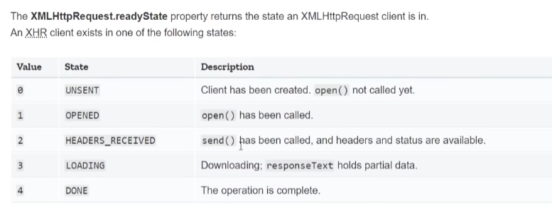

# 1. Async Javascript notes

One of the most important part of JavaScript

I will be using async JS at some point while crafting web projects

Used to perform tasks that take some time to complete
(getting data from DB)

first understand synchronous code..

    every statement execute after the other (in a single threaded environment --> JS)

    if at some point, you fetch some data from a DB, you stop the program (until you get the data ofc) --> "blocking code"

this is solved letting the browser handle the request of data while your code is doing stuff, then, when the data is fetched, a callback function is called and it finishes what the original function wanted to do. kinda.

"Start something now & finish it later"

---

## 2. HTTP request

- get data from another server
- so... requests to API endpoints

in this chapter we are using the JSONPlaceholder API

--

using the 'network' tab in the dev tools of chrome (or firefox?)
we can see the GET request made and all the details in the 'headers' inner-tab

however, we can log the data on the console.
guess what, with `console.log(request)` in a proper event listener, we can see the data in the console.



### if (ready state == 4)

    it means that the request is complete

    then it's time to do something with that data.

---

## 3. Status codes

I already know them. let's revise them

- 100 means infos
- 200 means success
- 300 means redirect
- 400 means client error
- 500 means server error

easy

    Actually, when the ready-state is 4
    the request is completed even if the url is incorrect.

    In that case, we get an empty object as a response.

    That's an issue!
    To solve that issue we handle the data only if
    the status code is 200 ( --> success)

---

## 4. Callback Functions

cutted and pasted all the code in a function named `getTodos()`

=> reusable code

now we can pass a callback function as an argument to `getTodos()`!

```javascript
const getTodos = (callback) => {
  //...
  if (request.readyState === 4 && request.status === 200) {
    callback(undefined, request.responseText);
  } else if (request.readyState === 4) {
    callback(`could not fetch data, status ${request.status}`, undefined);
  }
  //...
};

getTodos((err, data) => {
  console.log("Callback fired");

  if (err) console.log(err);
  else console.log(data);
});
```

---

## 5. Using JSON data

by using the `JSON.parse()` method,
we convert json data to javascript arrays and objects that can be actually used

we can also create our own json file easily...
Just remember to wrap everything in double-quotes!

---

## 6. Callback Hell

Created a folder containing 3 json files

> At some point in the future, it can happen that
> you make a request to an API and then use the data that the
> API gave you to make another request, this time to a different API...

Making all the request in turn.
One request after the other is finished.

I'm trying to do the same.

unfotunately, I have to nest every `getTodos()` in to the other...

or do I?

---

## 7. Promises

A promise is a task that takes some time to do,

a promise can either be

- RESOLVED -> we get the data we want
- REJECTED -> some error

`resolved()` and `rejected()` are also two built in methods in JS

when the promise is completed, we can use the **`.then()`** method

it can take two arguments that are callback functions.
The first is called when the promise is _resolved_,
the second one when is _rejected_

to make things more clear, we can use `.then()` with only one parameter to call when the promise is _resolved_, and use the **`.catch()`** method when is _rejected_
